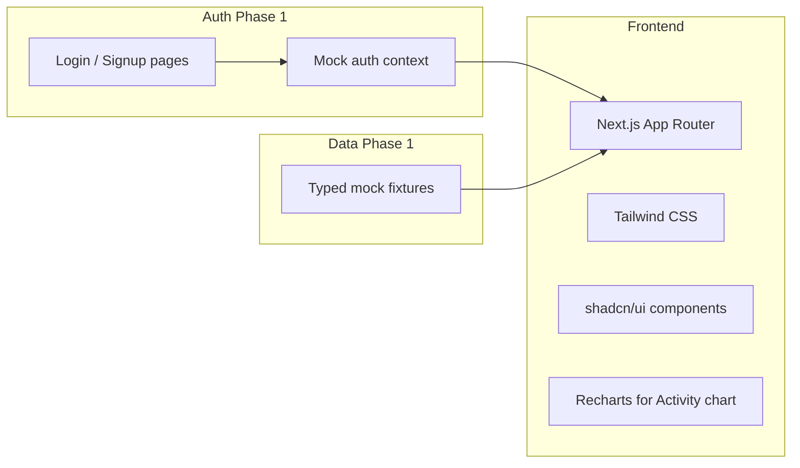
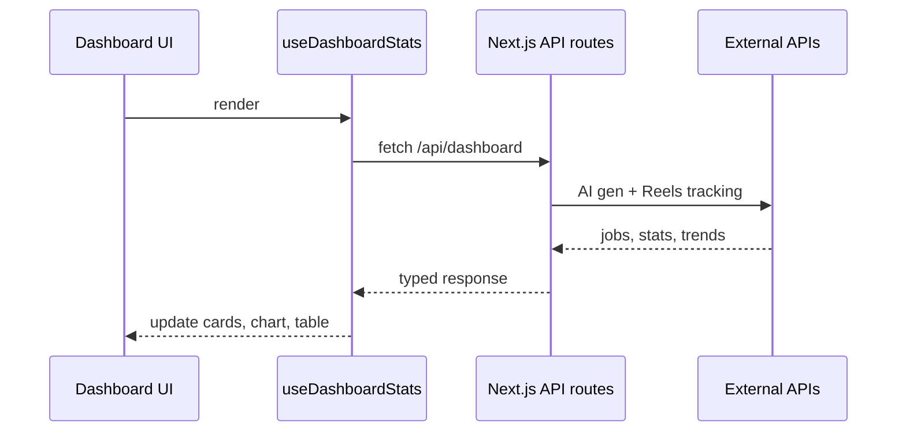

# AIInstaReels — UI Build Plan

## Is this possible?

**Yes.** The reference UI is a standard SaaS dashboard layout (fixed sidebar + scrollable main area + stat cards + chart + table + job list). It maps cleanly to a component-based React app. Since your repo at [`C:\Users\5900X\Desktop\CRM_AICONTENT`](C:\Users\5900X\Desktop\CRM_AICONTENT) is empty (Git only), we scaffold from scratch with mock data everywhere — no APIs required yet.

---

## Auth cost (your question)

| Approach | Cost now | When you wire APIs |
|---|---|---|
| **UI-only mock auth (recommended for phase 1)** | **$0** — login/signup screens, fake session in browser storage, route protection | Swap mock provider for real auth later (~1 day) |
| **Supabase Auth (free tier)** | **$0** — up to 50k monthly active users on free plan | Same provider for DB + storage later; Pro is $25/mo if you outgrow free |
| **Clerk** | **$0** — up to 10k MAU free | Pro from $25/mo; very polished UI but less control over backend |

**Recommendation:** Start with **UI-only mock auth** ($0, fastest). Structure auth as a swappable module so connecting Supabase (still $0 on free tier) later is a drop-in change, not a rewrite.

---

## Recommended stack



- **Next.js 15 (App Router) + TypeScript** — routing, layouts, auth middleware, future API routes
- **Tailwind CSS v4** — dark theme tokens matching reference (`#0f0f15` bg, `#7c3aed` purple accent)
- **shadcn/ui** — Button, Card, Table, Badge, Select, Dropdown (matches reference polish)
- **Recharts** — Activity line chart (Videos / Photos / Cost legend)
- **lucide-react** — sidebar + stat card icons
- **next-themes** — Light/dark toggle in sidebar footer

---

## Visual spec (from reference image)

| Element | Spec |
|---|---|
| Background | Deep charcoal `#0f0f15` |
| Accent | Purple `#7c3aed` (active nav, primary buttons, chart) |
| Status | Red failed, green completed, orange awaiting, blue cost links |
| Font | Inter (via `next/font`) |
| Layout | Fixed 260px sidebar + fluid main content, card borders, subtle radius |

Brand rename: **"Pipeline Content Studio" → "AIInstaReels"** everywhere (logo text, page title, metadata).

---

## App structure

```
app/
  (auth)/
    login/page.tsx          # Sign-in gate
    signup/page.tsx         # Sign-up gate
  (dashboard)/
    layout.tsx              # Sidebar + auth guard + theme provider
    page.tsx                # Dashboard (full reference UI)
    jobs/page.tsx
    video/...                 # Stub pages for each sidebar item
    image/...
    tools/...
    content/...
    analytics/spending/page.tsx
    system/settings/page.tsx
    system/logs/page.tsx
components/
  layout/
    sidebar.tsx             # Full nav with sections from reference
    dashboard-header.tsx    # Title, period select, New Job + Batch
  dashboard/
    stat-cards.tsx          # Running, Awaiting Review, Completed, Total Spend
    activity-chart.tsx      # 30-day line chart
    daily-breakdown-table.tsx
    recent-jobs-list.tsx
  ui/                       # shadcn primitives
lib/
  mock-data.ts              # Jobs, stats, chart series, daily rows
  auth/
    auth-context.tsx        # Mock session (swap for Supabase later)
    auth-guard.tsx
types/
  index.ts                  # Job, DashboardStats, DailyRow, etc.
middleware.ts               # Redirect unauthenticated users to /login
```

---

## Page-by-page build order

### 1. Project scaffold
- `create-next-app` with TypeScript, Tailwind, App Router, ESLint
- Install shadcn/ui, Recharts, lucide-react, next-themes
- Define CSS variables for dark/light themes in [`globals.css`](globals.css)

### 2. Auth gate (UI-only, $0)
- **Login page**: email + password form, purple primary CTA, link to signup
- **Signup page**: name, email, password, confirm password
- Mock `signIn` / `signUp` / `signOut` in [`lib/auth/auth-context.tsx`](lib/auth/auth-context.tsx) — stores user in `localStorage`, sets cookie for middleware
- **Middleware** in [`middleware.ts`](middleware.ts): protect all `(dashboard)` routes; redirect to `/login` if no session
- Same dark palette as dashboard for seamless transition

### 3. Dashboard shell
- [`components/layout/sidebar.tsx`](components/layout/sidebar.tsx) — all sections from reference:

  - **OVERVIEW:** Dashboard, Jobs
  - **VIDEO GENERATION:** Single Video, Batch Video, LTX Video, Infinite Talk, Face Swap, Video Creation
  - **IMAGE GENERATION:** Flexible Image, Construct Image
  - **TOOLS:** Image Upscaler, Voice Changer, Clothes Builder
  - **CONTENT:** Outputs, Assets, Trend Finder, Trend Library
  - **ANALYTICS:** Spending
  - **SYSTEM:** Settings, Logs

- Active route highlight (purple bg/glow)
- Light mode toggle at bottom
- Each nav item links to a stub page with page title + "Coming soon" placeholder (so navigation feels complete)

### 4. Dashboard main content (pixel match)
All data from [`lib/mock-data.ts`](lib/mock-data.ts) — values matching reference screenshot:

- **Header:** "Dashboard", "17125 total jobs", period dropdown (7/30/90 days), `+ New Job` (purple), `Batch` (secondary)
- **Stat cards (4):** Running `0`, Awaiting Review `3`, Completed `14549`, Total Spend `$1597.483` with sub-breakdown
- **Activity chart:** dual purple lines (Videos, Photos) + cost legend, "Last 30 days"
- **Daily breakdown table:** Date, Cost (blue), Videos, SFW Photos, NSFW Photos, Jobs, Failed (red when > 0)
- **Recent jobs:** job ID, type badge, status pill (Failed/Completed), progress bar, cost — "View all" link to `/jobs`

### 5. Reusable patterns for future API hookup
- Typed interfaces: `Job`, `DashboardStats`, `DailyBreakdown`, `ActivityPoint`
- Data-fetch hooks stubbed as `useDashboardStats()`, `useRecentJobs()` — return mock data now, swap implementation later
- Empty `lib/api/` folder with commented placeholders for future endpoints

---

## What is explicitly out of scope (phase 1)

- Real AI generation API calls
- Instagram / Reels API integration
- Real user database or email verification
- Payment / billing integration
- Mobile-responsive polish beyond basic sidebar collapse (can be phase 2)

---

## Future API connection path (when ready)



Replace mock hooks with `fetch('/api/...')` calls; auth context swaps from mock to Supabase client — UI components unchanged.

---

## Deliverables after implementation

- Runnable dev server (`npm run dev`)
- Login/signup gate protecting dashboard
- Full sidebar navigation with stub pages
- Dashboard matching reference layout, colors, and data structure
- Light/dark theme toggle
- README with env vars placeholder and "connect APIs" checklist
